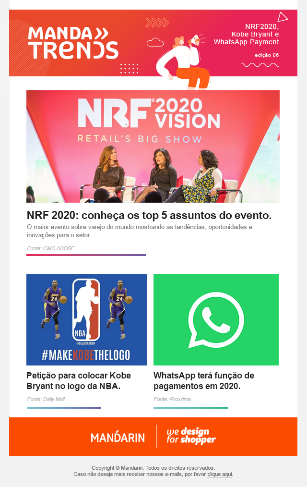

# MandaTrends Email Report 💌

O MandaTrends é um report que enviamos periodicamente para nossos clientes, repleto de conteúdo relevante e inovador. Inspire-se conosco!

## 🌐 Contexto do Projeto

Este projeto foi desenvolvido com base em um layout fornecido no formato `.PSD`. O layout foi meticulosamente convertido em um e-mail responsivo, considerando as peculiaridades e restrições associadas aos clientes de e-mail.

## 📸 Comparação entre Layout e Resultado Final

| Layout Original | Resultado Final |
|-----------------|-----------------|
|  |  |

## 🚀 Como Utilizar

1. Clone este repositório.
2. Abra o arquivo `manda-trends.html` em seu navegador ou cliente de e-mail para visualizar o design ou acesse o [link](https://lucaswenderson.github.io/manda-trends/).

## 🎨 Decisões de Design

- Adotou-se uma abordagem responsiva, garantindo adaptabilidade em diferentes dispositivos.
- O CSS foi aplicado diretamente nos elementos através de estilos inline, considerando a compatibilidade com os clientes de e-mail.
- Imagens são componentes-chave deste e-mail, proporcionando um visual atraente e informativo.
